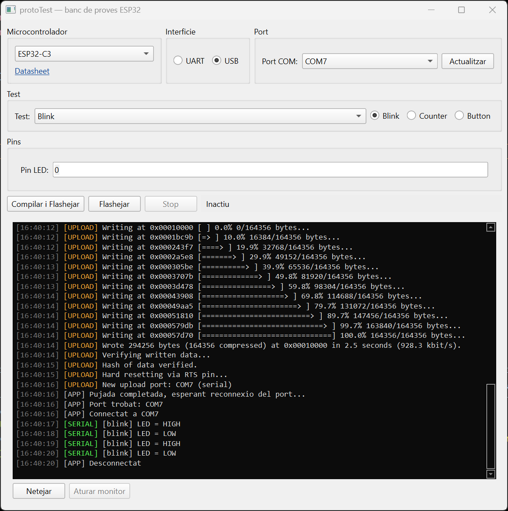

# protoTest — Arduino Universal Programs

**A one-click desktop tool to generate, compile, flash, and monitor Arduino/ESP32 test sketches — no Arduino IDE required.**

Pick a board, pick a hardware test, fill in the pins, hit **Compile & Flash**. protoTest generates the `.ino` sketch from a template, drives `arduino-cli` to compile and upload it, and opens a live serial monitor — all from a single PySide6 GUI window.

<!--  -->

## Table of Contents

- [Why this exists](#why-this-exists)
- [Features](#features)
- [Screenshots](#screenshots)
- [Supported boards](#supported-boards)
- [Built-in hardware tests](#built-in-hardware-tests)
- [Requirements](#requirements)
- [Installation](#installation)
- [Usage](#usage)
- [Project structure](#project-structure)
- [Extending protoTest](#extending-prototest)
  - [Add a new hardware test](#add-a-new-hardware-test)
  - [Add a new board](#add-a-new-board)
- [Standalone example sketches](#standalone-example-sketches)
- [ComToGraphic — serial plotter](#comtographic--serial-plotter)
- [License](#license)

## Why this exists

Bringing up a new board or verifying wiring on a bench usually means opening the Arduino IDE, hunting for the right example sketch, hand-editing pin numbers, picking the correct board/port, and watching Serial output in a separate window — repeated for every board revision. protoTest collapses that whole loop into one screen: **select → configure → flash → watch**.

## Features

- **Zero manual setup** — on first launch, protoTest downloads `arduino-cli` and installs every required board core (ESP32, AVR, Renesas UNO R4, SparkFun AVR) and library automatically, with live progress output.
- **Template-driven sketch generation** — hardware tests are `.ino` templates with typed placeholders (pins, counts) filled in from the GUI; no hand-editing of source files.
- **Duplicate-pin & range validation** — the pin form rejects conflicting or out-of-range GPIO assignments before compiling.
- **Board-aware options** — automatically applies board-specific build flags (e.g. `CDCOnBoot` for native-USB ESP32 variants) and shows per-board pre-flash notes (e.g. bootloader button sequence for Uno R4) and datasheet links.
- **Compile / Flash split** — recompiling isn't required to re-flash the same sketch to a different port or after a reset.
- **Auto port reconnection** — after upload, automatically waits for and reattaches to the board's serial port as it resets, then opens the monitor.
- **Integrated serial monitor** — tagged, color-coded console (`BUILD` / `UPLOAD` / `SERIAL` / `APP` / `ERROR`) with start/stop control, no external terminal needed.
- **Async, non-blocking UI** — compilation, upload, and serial I/O all run off the UI thread.

## Screenshots

| Main window |
|---|
|  |

## Supported boards

| Board | FQBN | Native USB | Notes |
|---|---|---|---|
| ESP32 (Dev Module / WROOM) | `esp32:esp32:esp32` | — | |
| ESP32-S2 | `esp32:esp32:esp32s2` | ✅ | |
| ESP32-S3 | `esp32:esp32:esp32s3` | ✅ | |
| ESP32-C3 | `esp32:esp32:esp32c3` | ✅ | |
| ESP32-C6 | `esp32:esp32:esp32c6` | ✅ | |
| Arduino Uno | `arduino:avr:uno` | — | |
| Arduino Mega 2560 | `arduino:avr:mega` | — | |
| Arduino Nano | `arduino:avr:nano` | — | |
| Arduino Uno R4 Minima | `arduino:renesas_uno:minima` | — | double-tap RESET to enter bootloader before flashing |
| Arduino Uno R4 WiFi | `arduino:renesas_uno:unor4wifi` | — | double-tap RESET to enter bootloader before flashing |
| SparkFun Pro Micro (ATmega32U4) | `SparkFun:avr:promicro` | — | |

New boards are added with a single entry in [`core/boards.py`](core/boards.py) — see [Add a new board](#add-a-new-board).

## Built-in hardware tests

| Test | Description | Configurable fields |
|---|---|---|
| Blink | Blinks an LED on a digital pin | LED pin |
| Blink Digital (WS2812) | Drives addressable WS2812/NeoPixel LEDs | Data pin, LED count |
| Counter | Prints an incrementing counter over Serial — no extra hardware | — |
| Button | Reads a pull-up button and prints state changes over Serial | Button pin |
| I2C Scanner | Scans the I2C bus and prints found device addresses | SDA, SCL |
| SD Card (SPI) | Mounts a microSD card over SPI and lists root files | MISO, MOSI, SCK, CS |
| OLED 128x32 (I2C) | Initializes an SSD1306 128x32 display and draws a test pattern | SDA, SCL |
| WiFi Scan | Scans nearby WiFi networks and prints them over Serial | — |

New tests are added with one registry entry plus one `.ino` template — see [Add a new hardware test](#add-a-new-hardware-test).

## Requirements

- Windows (tested platform; `run.bat` is Windows-specific)
- Python 3.11+
- Internet connection for the first run only (to download `arduino-cli` and board cores)

Python dependencies ([`requirements.txt`](requirements.txt)):

```
PySide6>=6.7
pyserial>=3.5
```

## Installation

```bash
git clone https://github.com/marticasamayor/Arduino_univeral_programs.git
cd Arduino_univeral_programs
run.bat
```

`run.bat` creates a local `.venv`, installs dependencies, and launches the app. On first launch, protoTest detects missing `arduino-cli` / board cores and runs the one-time setup dialog automatically.

Manual setup:

```bash
py -3 -m venv .venv
.venv\Scripts\pip install -r requirements.txt
.venv\Scripts\python main.py
```

## Usage

1. **Microcontroller** — pick the target board.
2. **Interface** — choose UART or native USB (only enabled for boards that support it).
3. **Port** — select the COM port; use **Refresh** if the board isn't listed yet.
4. **Test** — pick a hardware test from the dropdown (or the quick radio buttons for Blink / Counter / Button).
5. **Pins** — fill in the pins/parameters required by the selected test.
6. Click **Compile & Flash**. Progress streams live in the console: sketch generation → compile → upload → port reconnection → serial monitor.
7. Use **Flash** to re-upload the last compiled sketch (e.g. to a different port) without recompiling, or **Stop** to abort a running build/upload.

## Project structure

```
main.py                  Entry point — first-run setup dialog, launches MainWindow
core/
  boards.py               Board registry (FQBN, USB support, datasheet links, notes)
  tests_registry.py        Hardware test registry (fields, templates, baud rate)
  codegen.py                Fills a .ino template from a test + pin values
  arduino_cli.py            Wraps arduino-cli download/compile/upload as subprocesses
  serial_worker.py          Non-blocking serial read worker
  port_utils.py             COM port snapshot / reconnect-after-reset resolution
  setup.py                  First-run installer for arduino-cli, cores, and libraries
gui/
  main_window.py             Main window — state machine wiring UI to core
  pin_fields_widget.py        Dynamic pin/parameter form per test
  console_widget.py           Tagged, color-coded log console
templates/                 .ino templates with __PLACEHOLDER__ tokens
separated_programs/        Standalone example sketches per component/module
tools/                     Bundled arduino-cli.exe
build/                     Generated sketches (created/cleaned at runtime)
```

## Extending protoTest

### Add a new hardware test

1. Create a template in [`templates/`](templates/), e.g. `templates/my_test.ino.tpl`, using `__FIELD_KEY__` placeholders for pins/params and `__BAUD_RATE__` for the baud rate.
2. Register it in [`core/tests_registry.py`](core/tests_registry.py):

```python
"my_test": TestDefinition(
    id="my_test",
    label="My Test",
    description="What it does.",
    template_file="my_test.ino.tpl",
    fields=(
        FieldRole(key="MY_PIN", label="My pin", kind="pin", direction="output", default=5),
    ),
),
```

That's it — the test appears in the dropdown, and its pin form is generated automatically.

### Add a new board

Add one entry to `BOARD_REGISTRY` in [`core/boards.py`](core/boards.py):

```python
"my_board": BoardDefinition(
    id="my_board",
    label="My Board",
    fqbn="vendor:arch:board",
    supports_native_usb=False,
    led_builtin_pin=13,
    datasheet_url="https://...",
),
```

If the board's core isn't one of the ones auto-installed by [`core/setup.py`](core/setup.py), add its board-index URL and an install step there.

## Standalone example sketches

[`separated_programs/`](separated_programs/) holds independent, ready-to-open Arduino sketches for specific modules and ICs, used as reference/bring-up code outside the protoTest flow:

- **DFPlayer** — DFPlayer Mini MP3 module
- **MAX98357A** — I2S audio DAC/amplifier
- **PN532** — NFC/RFID reader over SPI
- **BQ25756 / TPS55288** — battery charger / buck-boost regulator ICs
- **ESPNOW** — ESP-NOW master/slave examples
- **SD card, OLED (SSD1306), I2C scanner, WiFi scan, button, blink, counter** — the same building blocks used as protoTest templates, as standalone sketches

## ComToGraphic — serial plotter

[`separated_programs/ComToGraphic/`](separated_programs/ComToGraphic/) is a small standalone PySide6 app that plots incoming serial data in real time — useful for visualizing sensor readings from any of the sketches above. It can be run from source or built into a standalone executable via `buildApp.bat`.

## License

No license file is currently included — all rights reserved by default. Open an issue if you'd like this project licensed for reuse.
